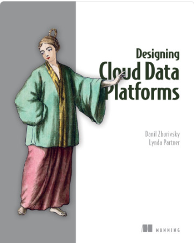
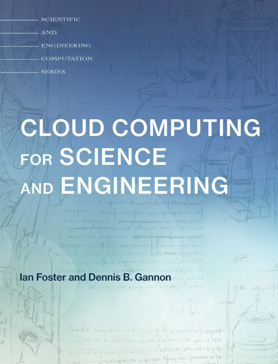
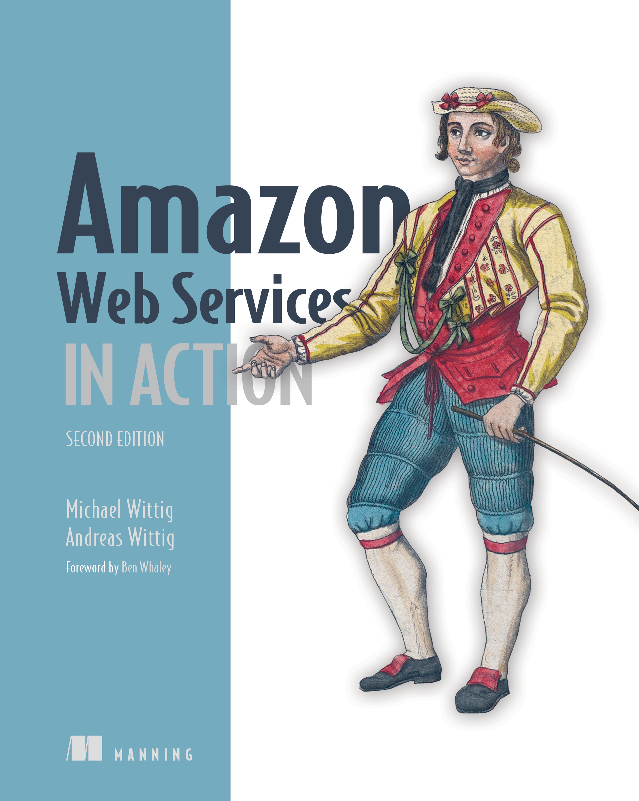
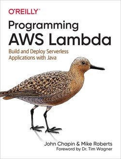
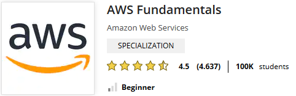

# Welcome!

**Matteo Francia, Ph.D.**

- Assistant Professor (junior) @ DISI, University of Bologna
- Email: [m.francia@unibo.it](mailto:m.francia@unibo.it)
- Web: [https://www.unibo.it/sitoweb/m.francia/en](https://www.unibo.it/sitoweb/m.francia/en)

I teach:

- [DTM] Big Data and Cloud Platforms (Module 2)
- [DTM] Machine Learning and Data Mining (Module 2)

I work on:

- Big data, databases, and machine learning
- Precision agriculture and spatio-temporal analytics

[BIG - Business Intelligence Group](https://big.csr.unibo.it/)

-  [https://big-unibo.github.io](https://big-unibo.github.io)
- With Prof. Golfarelli and Prof. Gallinucci
- Thesis projects: [https://big-unibo.github.io/thesis/](https://big-unibo.github.io/thesis/)

# What This Module Is About

Handling data pipelines in the cloud means learning how data moves from raw sources to reliable analytical systems.

In this module, we will discuss:

* *Data platforms*: from databases to integrated data ecosystems
* *Cloud computing*: service models, deployment models, and core terminology
* *Cloud platforms*: the main services used to build modern data architectures
* *Billing models*: how technical choices become economic choices
* *Migration*: moving from on-premises clusters to cloud-based architectures
* *Case studies and labs*: applying the concepts to realistic scenarios

The goal is not to memorize a catalog of services.

The goal is to understand how to **connect data needs, architectural choices, and business constraints**.

# Learning Outcomes

At the end of the module, you should be able to:

* Explain why modern organizations need *data platforms*
* Compare *on-premises* and *cloud* architectures
* Identify the main building blocks of a cloud data pipeline
* Reason about scalability, reliability, governance, and cost
* Read technical documentation and extract the architectural ideas that matter
* Discuss case studies by connecting information systems, BI, data mining, big data, and machine learning

Seminars by companies working with cloud and big data platforms are part of the course.

... and **all these points** may be part of the oral examination! :)

# Exam

The exam covers all **theoretical** and **practical** aspects of the course.

* A *single oral session* with both teachers
* Covers *both modules*
* *Seminars and labs* are included
* *Interaction during lectures/labs* contributes to the final evaluation

The exam is not a technical troubleshooting session.

- However, you must be able to explain the concepts, motivate design choices, and connect the dots

No scheduled dates: come **when you are ready**.

* Book at least one week in advance
* Use the [Booking](https://outlook.office365.com/owa/calendar/BigDataandCloudPlatformsexams@live.unibo.it/bookings/) application

According to the University's regulation:

* Exams must be in person
* You **cannot reject a grade more than once**

Be prepared: in any case, you must wait **1 month before trying again**.

# Office hours

Lectures start/end 10 minutes later/earlier than the time stated in the teaching calendar

- Please, **arrive on time** to avoid interruptions

Office hours:

- *Short questions*: before/after each lecture
- *Longer questions*: send an email to book an appointment

If you need help with coding and labs, *you can ask me and the assigned tutor*.

# Context

# Context

**Data platforms as the foundation**

- Provide *centralized, reliable, and scalable* access to enterprise data
- Ensure *data quality, integration, and governance*
- Enable *real-time analytics* and advanced *AI/ML models*

**Why this matters for Decision Support Systems (DSS)**

- A DSS relies on *timely, consistent, and trustworthy data*
- Without a robust data platform, insights may be *incomplete, delayed, or misleading*

**Role of the data architect**

- Designs the *structure and flow* of the data platform
- Defines *data models, standards, and integration strategies*
- Bridges business needs and technical capabilities

**Data platform + skilled data architect** = reliable, actionable, and impactful decision support.

# So far

You have already practiced with *on-premises* solutions.

* You were given a working hardware cluster
* ... to deploy software applications on a Hadoop-based stack

> **Digital transformation**: The process of using digital technologies to create new — or modify existing — business processes, culture, and customer experiences to meet changing business and market requirements

From the perspective of digital transformation, let us ask:

* How would you start from scratch?
* How much time would it take?

# So far

There are no easy answers: big-data architectures require many skills.

* *Configuration*: how do I set up dozens of new machines?
* *Networking*: how do I cable dozens of machines?
* *Management*: how do I replace a broken disk?
* *Upgrade*: how do I extend the cluster with new services/machines?
* (energy and cooling, software licenses, insurance, ...)

[https://aws.amazon.com/compliance/data-center/data-centers/](https://aws.amazon.com/compliance/data-center/data-centers/)

# So far

Cloud data platforms sit between two perspectives, and your profile is a good fit for both.

* **Technological** perspective
  * How do we configure a distributed environment?
  * How do we set up, integrate, and control independent services?
  * How do we orchestrate data flows?
* **Business** perspective
  * Can we afford to spend resources on tasks that are not mission-oriented?
    * Mission: a statement used by a company to explain its purpose(s)
  * No free lunch, each choice has a cost/benefit
  * *How much time* does it take to master a technology?
  * *How many people* do I need?

... but first, what are our **data needs**?

# Teaching material

::::{.columns}
:::{.column width=25%}

:::
:::{.column width=25%}

:::
:::{.column width=25%}

:::
:::{.column width=25%}

:::
:::{.column width=50%}

:::
:::{.column width=50%}

:::
::::

# Teaching material

You will find all you need in these slides.

* However, keeping up the pace with data platforms and the cloud is hard
* There is a rapid development of technologies, and not all of them will survive
* Books are easily outdated with respect to cutting-edge services and technologies
* Research papers (often) describe solutions that are not commercial yet
* (IRL) You will need to deal with a lot of (bad) documentation, online articles, etc.

Rule of thumb

* Understand the general concepts
* Do not be afraid of change
* *Connect the dots... and ask questions*!
