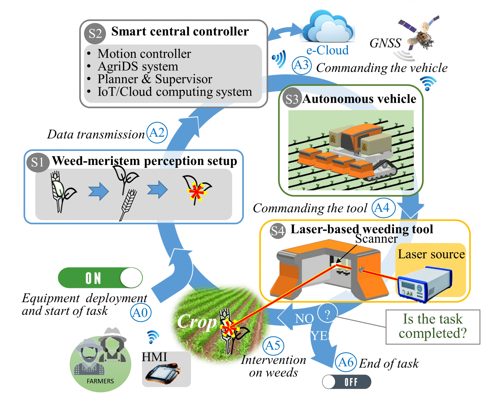
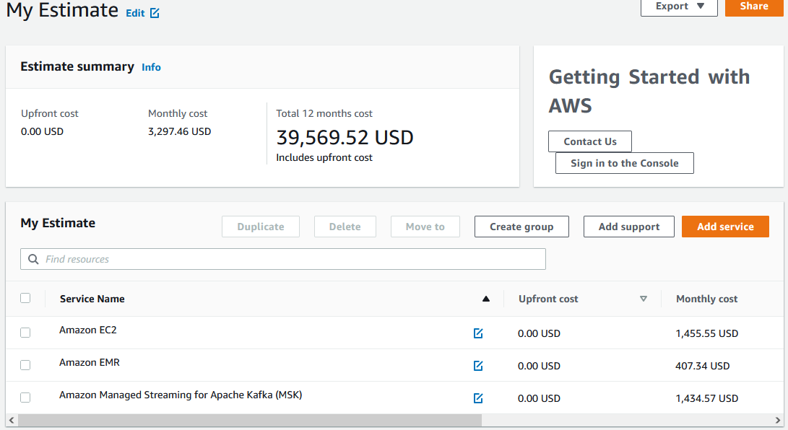
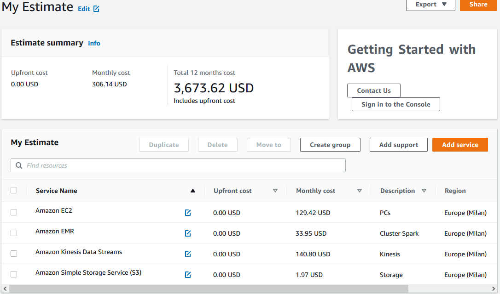

# The WeLASER project

::::{.columns}
:::{.column width=60%}

**Project description**

- The increased use of pesticides and fertilizers damages the environment, destroys non-target plants and beneficial insects for the soil, and harms human and animal health. Most seeds develop herbicide-resistant properties, rendering pesticides ineffective. Mechanical automatic systems that are studied as alternatives to pesticides deteriorate soil features, damage beneficial soil organisms, and offer limited results for in-row weeding. The EU-funded WeLASER project will develop a non-chemical solution for weed management based on pioneering technology consisting of the application of lethal doses of energy on the weed meristems through a high-power laser source. An AI-vision system separates crops from weeds, identifying the weed meristems and pointing the laser at them. A smart controller based on IoT and cloud computing techniques coordinates the system, which is transferred all over the field by an autonomous vehicle.

:::
:::{.column width=40%}

:::
::::

[https://cordis.europa.eu/project/id/101000256](https://cordis.europa.eu/project/id/101000256) (accessed 2020-08-01)

# The WeLASER project

::::{.columns}
:::{.column width=60%}

Which requirements do you foresee?

- Can we define a tentative (service) architecture for the WeLASER project?

Assumptions

- Do not consider the collection of weed/crop images
- ... and training/deploying the CV algorithm

:::
:::{.column width=40%}

:::
::::

# [Data sources](https://docs.google.com/spreadsheets/d/17zEr62CzyqeIy0vU-DcjEUoxf6bMd3ziLSSeIXvk4Lg/edit?usp=sharing)

*8 cameras on the field*, average image size 3MB; two services:

- *Alerting*: a camera sends an image when smth enters the field (at most 1 img every 5 min); assuming $20 \frac{alerts}{day}$
  - $20 \frac{𝑎𝑙𝑒𝑟𝑡}{𝑑𝑎𝑦}  \cdot 1 \frac{𝑖𝑚𝑎𝑔𝑒}{𝑎𝑙𝑒𝑟𝑡} \cdot 8 \frac{𝑐𝑎𝑚𝑒𝑟𝑎}{𝑓𝑖𝑒𝑙𝑑} = 160 \frac{𝑖𝑚𝑎𝑔𝑒}{𝑑𝑎𝑦 \cdot 𝑓𝑖𝑒𝑙𝑑}$
  - $160 \frac{𝑖𝑚𝑎𝑔𝑒}{𝑑𝑎𝑦 \cdot 𝑓𝑖𝑒𝑙𝑑} \cdot 3 \frac{𝑀𝐵}{𝑖𝑚𝑎𝑔𝑒}=480 \frac{𝑀𝐵}{𝑑𝑎𝑦 \cdot 𝑓𝑖𝑒𝑙𝑑}  ~= 500 \frac{𝑀𝐵}{𝑑𝑎𝑦 \cdot 𝑓𝑖𝑒𝑙𝑑}$
- *Monitoring the crop/weed*; assuming $2 \frac{images}{day}$
  - $2 \frac{𝑖𝑚𝑎𝑔𝑒}{𝑑𝑎𝑦} \cdot 8 \frac{𝑐𝑎𝑚𝑒𝑟𝑎}{𝑓𝑖𝑒𝑙𝑑}=16 \frac{𝑖𝑚𝑎𝑔𝑒}{𝑑𝑎𝑦 \cdot 𝑓𝑖𝑒𝑙𝑑}$
  - 1$6 \frac{𝑖𝑚𝑎𝑔𝑒}{𝑑𝑎𝑦 \cdot 𝑓𝑖𝑒𝑙𝑑} \cdot 3 \frac{𝑀𝐵}{𝑖𝑚𝑎𝑔𝑒}=48 \frac{𝑀𝐵}{𝑑𝑎𝑦 \cdot 𝑓𝑖𝑒𝑙𝑑}$ ~= $50 \frac{𝑀𝐵}{𝑑𝑎𝑦 \cdot 𝑓𝑖𝑒𝑙𝑑}$

*Weather station*: $24 \frac{measurement}{day}$ for humidity/solar radiation/temperature/wind; $1 \frac{KB}{measurement}$

- $24 \frac{𝑠𝑎𝑚𝑝𝑙𝑒}{𝑑𝑎𝑦} \cdot 4 \frac{𝑚𝑒𝑎𝑠𝑢𝑟𝑒𝑚𝑒𝑛𝑡}{𝑠𝑎𝑚𝑝𝑙𝑒} \cdot 1 \frac{𝑤𝑒𝑎𝑡ℎ𝑒𝑟~𝑠𝑡𝑎𝑡𝑖𝑜𝑛}{𝑓𝑖𝑒𝑙𝑑}=96 \frac{𝑚𝑒𝑎𝑠𝑢𝑟𝑒𝑚𝑒𝑛𝑡}{𝑑𝑎𝑦 \cdot 𝑓𝑖𝑒𝑙𝑑}$
- $96 \frac{𝑚𝑒𝑎𝑠𝑢𝑟𝑒𝑚𝑒𝑛𝑡}{𝑑𝑎𝑦 \cdot 𝑓𝑖𝑒𝑙𝑑} \cdot 1 \frac{𝐾𝐵}{𝑚𝑒𝑎𝑠𝑢𝑟𝑒𝑚𝑒𝑛𝑡}=96 \frac{𝐾𝐵}{𝑑𝑎𝑦 \cdot 𝑓𝑖𝑒𝑙𝑑}  ~= 0.1 \frac{𝑀𝐵}{𝑑𝑎𝑦 \cdot 𝑓𝑖𝑒𝑙𝑑}$

*Robot mission*: lasts 4 hours, $100 \frac{measurement}{s}$ from sensor systems; $1\frac{KB}{measurement}$

- $3600 \frac{𝑠𝑒𝑐𝑜𝑛𝑑}{ℎ𝑜𝑢𝑟} \cdot 4 \frac{ℎ𝑜𝑢𝑟}{𝑚𝑖𝑠𝑠𝑖𝑜𝑛} \cdot 100 \frac{𝑚𝑒𝑎𝑠𝑢𝑟𝑒𝑚𝑒𝑛𝑡}{𝑠𝑒𝑐𝑜𝑛𝑑} \cdot 1 \frac{𝑚𝑖𝑠𝑠𝑖𝑜𝑛}{𝑑𝑎𝑦 \cdot 𝑓𝑖𝑒𝑙𝑑} \cdot 1 \frac{𝐾𝐵}{𝑚𝑒𝑎𝑠𝑢𝑟𝑒𝑚𝑒𝑛𝑡}=1.44  \frac{𝐺𝐵}{𝑑𝑎𝑦 \cdot 𝑓𝑖𝑒𝑙𝑑}$ ~= $2 \frac{𝐺𝐵}{𝑑𝑎𝑦 \cdot 𝑓𝑖𝑒𝑙𝑑}$
  
*Historic data*; worst case of $1\frac{KB}{document}: $10^3$ Json documents describing the farm  ~= $1 \frac{𝑀𝐵}{𝑓𝑎𝑟𝑚}$

# Workload

Nothing special

- Every night compute aggregated indexes on the collected data (2h/day)

On-premises (HDFS cluster)

- How many machines do we need?
- With which resources?

# On-premises

::::{.columns}
:::{.column width=60%}

On-premises

- How many machines do we need? *4*: *1 master node* + *3 HDFS data nodes*
- With which resources?
  - Assuming an HDFS replication factor of 3, we need at least 1TB of disk
  - Think bigger: at least 8 cores, 64GB RAM, 500GB SSD + 4TB HDD
  - 8700€ / 3 years = 2900€

:::
:::{.column width=40%}

|  | On-premises | On cloud |
|:-: |:-: |:-: |
| Hardware | 2900€/year |? |
| Software | 40000€/year |? |

:::
::::

::::{.columns}
:::{.column width=50%}

 as of 2022-09-01](img/slides350.png)

:::
:::{.column width=50%}

 as of 2022-09-01](img/slides351.png)

:::
::::

# On cloud v1

::::{.columns}
:::{.column width=60%}

Moving the Hadoop cluster as IaaS

EC2 (4)

- Pricing strategy (EC2 Instance Savings Plans 3 Year No Upfront)
- Storage amount (4 TB)
- Instance type (r6g.2xlarge)

EMR

- Master (1): EC2 instance (r5.2xlarge), Utilization (100% Utilized/Month)
- Core (3): EC2 instance (r5d.2xlarge), Utilization (100% Utilized/Month)

*MKS (KAFKA)*

- Storage per Broker (10 GB), \#broker nodes (3), Compute Family (m5.2xlarge)

:::
:::{.column width=40%}

| [$SOL_{cloud 1}$](https://calculator.aws/#/estimate?id=05965ca7de23fd9e7d2ab2cd0175fe8c01822c9c) | On-premises | On cloud |
|:-: |:-: |:-: |
| Hardware | 2900€/year | ~40000$/year |
| Software | 40000€/year |? |

:::
::::

# On cloud v2

::::{.columns}
:::{.column width=60%}

Moving the Hadoop cluster as PaaS

EC2 (4)

- Pricing strategy (*On-Demand Instances*)
- Storage amount (*30 GB*)
- Instance type (r6g.2xlarge)

EMR

- Master (1): EC2 instance (r5.2xlarge), Utilization (*2 Hours/Day*)
- Core (3): EC2 instance (r5d.2xlarge), Utilization (*2 Hours/Day*)

*S3*

- Standard storage (60 GB per month)

*Kinesis*

- Days for data retention (1 day), Records (100/second), Consumers (3)

:::
:::{.column width=40%}

| [$SOL_{cloud 2}$](https://calculator.aws/#/estimate?id=53f60ff0412a18877dc8e1274f7d9875aa3bf665) | On-premises | On cloud |
|:-: |:-: |:-: |
| Hardware | 2900€/year | ~4000$/year |
| Software | 40000€/year |? |

:::
::::

# How would you evaluate the cost and the price?

*Price* is the amount a customer is willing to pay for a product or service

*Cost* is the expense incurred for creating a product or service

- Hardware
- Development
- Maintenance

*Profit* is the difference between the price paid and costs incurred is the profit

- If a customer pays $10 for a product that costs $6 to make and sell, the company earns $4